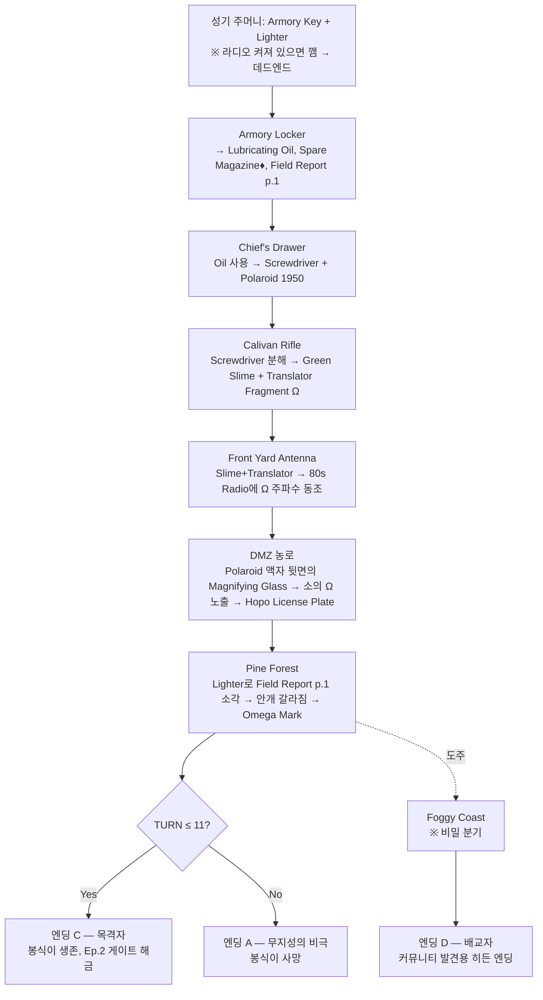

# 〈HOPE: Omega Protocol〉 게임 리뉴얼 구현 계획서

> [!WARNING]
> **Superseded pre-release implementation plan.** It documents the removed Omega/slime prototype and must not be used as current canon. Use the authoritative [`game_story_bible.md`](./game_story_bible.md) for the complete four-episode narrative; implemented Episode 1–4 behavior remains defined by [`lib/game/episode1.ts`](../lib/game/episode1.ts), [`lib/game/episode2.ts`](../lib/game/episode2.ts), [`lib/game/episode3.ts`](../lib/game/episode3.ts), [`lib/game/episode4.ts`](../lib/game/episode4.ts), and [`app/guide/page.tsx`](../app/guide/page.tsx).

> 본 문서는 [docs/game_story_design.md](./game_story_design.md)의 시나리오를 기반으로 **스토리 로직을 한 단계 더 강화**하고, 현재 `app/game/page.tsx`에 단편적으로 구현되어 있는 점프형 퍼즐을 **유작(遺作) 수준의 트리거 벨트**로 재설계하기 위한 구현 가이드입니다. 본 PR의 일차 구축 대상은 **Episode 1**이며, Ep.2–4와의 연결 훅(hook)도 데이터 레벨에서 동시 설계합니다.

---

## 0. 현재 상태와 문제점

- 현재 [app/game/page.tsx](../app/game/page.tsx) (~990 LoC)는 세 개의 방(OFFICE / FRONT_YARD / STORAGE)과 다섯 개의 아이템(Screwdriver, Cabinet Key, 80s Radio, Torn ID Tag, Green Alien Slime)을 가진 점-앤-클릭 루프입니다.
- 핫스팟이 대부분 **독립적**으로 동작하여 "트리거 벨트"가 사실상 부재합니다.
- **실패 엔딩이 없고**, **시간 압박이 없으며**, **잘못된 선택이 영구적 손실로 이어지지 않습니다**.
- 대사는 설명적이고, 시각은 사진 합성 위주여서 〈HOPE〉의 1980년대 DMZ 어촌 코스믹 호러 정조가 아직 살지 않습니다.

→ **유작급 하드코어**(트리거 벨트, 타임 카운터, 다중 엔딩, 데드엔드, 잃어버릴 수 있는 아이템) + **나홍진식 코스믹 호러**(은유적 대사, 시점의 불안정성) + **CGC 스토리 갭**(커뮤니티가 메우도록 의도된 비어 있는 페이지)을 동시 달성하도록 Episode 1 전체를 재구축합니다.

---

## 1. Episode 1 강화 시나리오 — "이그노런스: 소(牛)에 새겨진 오메가"

### 1.1. 개요

- **시점:** 1983년 8월 ○○일 18:40. 호포항.
- **주인공:** 갓 부임한 방위병 분대장(플레이어).
- **현장:** 파출소의 전화·무전이 모두 죽었다. 농로의 황소 한 마리가 도살되어 옆구리에 인두로 지져진 **Ω** 문양을 남기고 있다. Sgt. 성기는 책상에서 졸고 있고, 칼리반 소총은 총가에 잠겨 있다. 안개가 **바람의 반대 방향으로** 움직인다.
- **목표:** 마을 청년 '봉식이'가 혼자 농로로 나가기 전에 사태의 정체를 모으는 것 — 혹은 우주가 그를 먹어 치우는 것.

### 1.2. 시간 압박(TURN Clock)

게임 시간은 **TURN 1 → TURN 12**까지 진행되는 추상 시계입니다. 다음 동작이 TURN을 소모합니다:

| 동작 | TURN 비용 |
|---|---|
| 방 이동 | +1 |
| 잘못된 아이템으로 핫스팟 클릭 | +1 |
| NPC와 같은 주제로 두 번 대화 | +2 |
| 책상에서 단순 관찰(올바른 단서) | 0 |
| Polaroid·Field Report 읽기 | 0 |

- **TURN 8**에 봉식이가 파출소 앞마당을 떠납니다(이벤트 점화).
- **TURN 12**에 강제로 엔딩이 결정됩니다.

### 1.3. 정전(canonical) 트리거 벨트



♦ **Spare Magazine**은 의도된 **레드 헤링**입니다. 분해 전 칼리반에 장전하면 격발이 되어 Slime이 파괴됩니다(엔딩 A 확정).

### 1.4. 데드엔드 / 잃어버릴 수 있는 아이템

| 잘못된 행동 | 결과 |
|---|---|
| TURN 1에 80s Radio를 켠 채 성기 주머니를 뒤짐 | 성기가 깸 → 사무실 잠금 → Screwdriver 획득 불가 → **TURN 8에 엔딩 B (군법회의)** |
| 분해 전 Spare Magazine을 장전 | Slime 파괴 → 숲 안개 영구 유지 → **TURN 12에 엔딩 A** |
| Radio·Translator·Slime 동조 전에 농로로 진출 | 잘못된 시각에 도착 → 까마귀가 License Plate를 물고 감 → **License Plate 영구 손실** (엔딩 C 진입 가능하지만 Ep.4 시나리오 슬롯 1개 영구 결손) |
| 앞마당에서 봉식이와 두 번 같은 주제로 대화 | 봉식이 조기 출발 → TURN +3 점프 |
| Polaroid 액자를 뜯지 않고 농로 진입 | Magnifying Glass 미획득 → 소의 Ω가 보이지 않음 → 숲 진입 거부 |
| Field Report p.1을 소각 전 잃어버림(Locker 닫기 전에 꺼내지 않음) | 안개 갈라지지 않음 → 엔딩 A |

### 1.5. 네 가지 엔딩

| ID | 이름 | 조건 | 결과 |
|---|---|---|---|
| **A** | 무지성의 비극 (Ignorance-Born Tragedy) | TURN 12 도달 또는 Slime 파괴 또는 안개 미해제 | 봉식이 사망. 성기가 시신을 발견. 화면이 정적 노이즈로 잠김. |
| **B** | 군법회의 (Court-Martial) | 성기를 깨움 또는 칼리반 파손 | 사무실 잠금 → 강제 재시작. 토큰 게이트 카운터 1회 소모. |
| **C** | 목격자 (Witness) — 정전 엔딩 | 트리거 벨트 완주 + TURN ≤ 11 | 봉식이 생존, **Omega Mark** 인벤토리 영구 보존, **Ep.2 게이트(5,000 \$NAHOPE) 해금**. |
| **D** | 배교자 (Apostate) — 히든 | 안개 해제 후 봉식이를 두고 Coast로 이탈 + 특정 입력 시퀀스 | 다른 Ω 각인 획득. Ep.2 분기가 갈림. **CGC 스토리 갭**: 발동 조건의 일부를 의도적으로 코드에 남기지 않고 커뮤니티 추리에 위임. |

### 1.6. 의도된 스토리 갭(CGC 훅)

다음 항목은 **Episode 1 내부에서는 의도적으로 미해결**로 남깁니다. 커뮤니티가 시나리오 제안을 통해 채워야 합니다:

1. **Field Report p.2 / p.3** — 캐비닛 안 어디에도 없음. "33년 주기"의 의미.
2. **Polaroid 1950 속 아이의 정체** — 같은 Ω을 이마에 새기고 있다.
3. **Foggy Coast의 비-희랍 알파벳** — Translator Fragment로 일부만 해독 가능.
4. **엔딩 D 트리거 전체 시퀀스** — 코드에는 유효한 입력 검증만 존재. 시퀀스 자체는 힌트 조각으로만 분산 배치.

→ 이 항목들은 [docs/game_story_design.md](./game_story_design.md) Ep.4 "오메가 프로토콜" 시나리오 제출 시스템과 직접 연결됩니다.

---

## 2. UI / 비주얼 재설계

### 2.1. 메타포: "방위사령부 상황판"

플레이어는 게임을 하는 것이 아니라 1983년 방위사령부의 **상황판(situation board)**을 운용하고 있습니다.

| 영역 | 비율 | 내용 |
|---|---|---|
| **HEADER** | 상단 고정 | 날짜·시각, **TURN 카운터**, Ω-채널 신호 바, 지갑 배지 |
| **LEFT — DOSSIER** | 28% | 트랜스크립트 로그(현재 유지) + 마지막 발화자의 **픽셀 초상(bust)** + 단서가 채워질수록 검정 마스킹이 벗겨지는 **Field Report 페이퍼** |
| **CENTER — PLATE** | 44% | 손그림/픽셀 2D 배경 + SVG 핫스팟 레이어. 커서는 Ω 십자선. 잘못된 활성 아이템에서는 **글리치 십자선** (단서 제공) |
| **RIGHT — EVIDENCE DECK** | 28% | 인벤토리를 **코르크보드+폴라로이드+빨간 실** UI로 교체. 활성 아이템은 "USE ON…" 어피던스. 하단에 6 노드의 **MAP**, 잠긴 노드는 검정 마스킹. |
| **FOOTER** | 하단 고정 | 지갑 잔고 · 현재 위치 · TURN 시계(턴 전환 시 심박 애니메이션) |

### 2.2. 비주얼 톤

- 6개 위치별 **픽셀/회화풍 2D 플레이트**: Office, Armory, Yard, Field, Forest, Coast → `public/images/game/ep1/` 하위에 `office.png` 등으로 저장.
- 기존 [app/globals.css](../app/globals.css)의 `.crt-scan`, `.crt-vignette`, 글리치 키프레임, 컬러 토큰(`--acc-primary`, `--acc-danger`, `--acc-violet`) **모두 재사용**.
- 신규 토큰: `--paper-stain`(세피아), `--redact-black`(서류 마스킹), `.polaroid-frame` 유틸, `.pixelated`(image-rendering).
- 아이템 획득 모달은 **폴라로이드 현상 애니메이션** (1.2s, 스캔라인 와이프 → 샤프닝)으로 교체.

### 2.3. 모바일

기존 3-tab fallback 유지: **PLATE / DOSSIER / DECK**. TURN 시계는 footer에 상시 표시. MAP은 footer로 접힘.

### 2.4. 사운드

기존 Web Audio 신스 유지. 추가 큐 2종:

- `tick` — TURN 전환
- `whisper` — 잘못된 활성 아이템으로 핫스팟 호버 (가청 한계의 110Hz sub-bass + 화이트 노이즈 80ms)

신규 라이브러리 의존성 없음.

---

## 3. 코드 구조

### 3.1. 디렉터리

```
app/game/
  page.tsx                ← Thin orchestrator (≤ 250 LoC 목표)
  layout.tsx              ← 변경 없음
components/game/
  GameShell.tsx           ← header + footer + TURN clock + wallet badge
  PlateCanvas.tsx         ← 중앙 plate 렌더러 (Scene desc → image + hotspot SVG)
  Dossier.tsx             ← left rail
  EvidenceBoard.tsx       ← right rail (corkboard + map)
  DiscoveryToast.tsx      ← 폴라로이드 현상 애니메이션
lib/game/
  episode1.ts             ← 퍼즐 데이터 (Scenes / Items / Interactions / Endings)
  state.ts                ← useGameState() — reducer + Firestore sync
  types.ts                ← Scene, Item, Hotspot, Interaction, Flag, Ending
public/images/game/ep1/   ← 6개 plate + 3개 portrait (1차 PR은 placeholder)
docs/
  game_implementation_plan.md   ← 본 문서
  game_story_design.md          ← 기존, 변경 없음
```

### 3.2. 데이터 주도형 인터랙션

핫스팟 분기를 JSX의 if문에서 **선언형 규칙 테이블**로 옮깁니다.

```ts
// lib/game/types.ts
export type SceneId = "OFFICE" | "ARMORY" | "YARD" | "FIELD" | "FOREST" | "COAST";
export type ItemId =
  | "ARMORY_KEY" | "LIGHTER" | "OIL" | "SPARE_MAG"
  | "SCREWDRIVER" | "POLAROID_1950" | "MAGNIFIER"
  | "GREEN_SLIME" | "TRANSLATOR_FRAG" | "OMEGA_MARK"
  | "FIELD_REPORT_P1" | "LICENSE_PLATE" | "RADIO_80S";

export interface Interaction {
  scene: SceneId;
  hotspot: string;
  requires?: { item?: ItemId; flag?: string; turnLte?: number };
  consumes?: ItemId[];                // 사용 시 인벤토리에서 제거
  destroys?: ItemId[];                // 게임에서 영구 제거(잃어버린 아이템)
  grants?: ItemId[];
  setFlags?: string[];
  log: { role: string; text: string; kind?: "voice"|"omega"|"danger"|"system" };
  turnCost?: number;                  // 기본 1, 정답 단서는 0
  triggersEnding?: "A"|"B"|"C"|"D";
}
```

```ts
// lib/game/episode1.ts — 발췌
export const MAX_TURNS = 12;
export const INTERACTIONS: Interaction[] = [
  {
    scene: "OFFICE", hotspot: "SUNGKI_POCKET",
    requires: { flag: "!RADIO_ON" },
    grants: ["ARMORY_KEY", "LIGHTER"],
    setFlags: ["SUNGKI_PICKED"],
    log: { role: "SYSTEM", text: "성기의 호흡이 깊다. 주머니에서 열쇠 두 개를 꺼냈다.", kind: "system" },
  },
  {
    scene: "OFFICE", hotspot: "SUNGKI_POCKET",
    requires: { flag: "RADIO_ON" },
    setFlags: ["SUNGKI_AWAKE"],
    triggersEnding: "B",
    log: { role: "SUNG-KI", text: "'…어이, 너 지금 뭐 하냐?'", kind: "danger" },
  },
  // …(전체 28개 규칙 — Armory, Drawer, Rifle, Antenna, Field, Forest, Coast)
];
```

리듀서는 다음만 안다:

```ts
type Action =
  | { kind: "INSPECT"; scene: SceneId; hotspot: string }
  | { kind: "USE"; scene: SceneId; hotspot: string; item: ItemId }
  | { kind: "MOVE"; to: SceneId }
  | { kind: "TALK"; npc: string; topic: string }
  | { kind: "WAIT" };
```

리듀서는 `INTERACTIONS`에서 첫 번째로 매칭되는 규칙을 찾아 적용하고, `turn`을 증가시키고, `triggersEnding`이 있으면 엔딩 결정 함수에 위임합니다. **모든 분기 로직이 데이터로 존재**하므로, 엔딩 D의 시퀀스 추가나 새로운 레드 헤링 도입은 컴포넌트 수정 없이 가능합니다.

### 3.3. Firestore 연동

기존 [lib/firebase.ts](../lib/firebase.ts)의 `UserProfile` 스키마를 다음과 같이 확장합니다(기존 필드는 보존):

```ts
interface UserProfile {
  walletAddress: string;
  currentEpisode: number;
  unlockedHotspots: string[];
  inventory: Record<string, { type: string; isUGC: boolean }>;
  submitPermission: boolean;
  point: number;
  // === 추가 ===
  ep1?: {
    turn: number;
    flags: string[];
    endingId?: "A"|"B"|"C"|"D";
    lostItems: string[];          // 까마귀가 가져간 License Plate 등
    completedAt?: number;
  };
}
```

저장은 디바운스 500ms로 백그라운드 동기화(기존 `page.tsx`의 동작 보존).

### 3.4. 토큰 게이트

- Ep.1 자체는 무료 데모(기존 정책 유지).
- 엔딩 C 도달 시 "Ep.2 게이트: 지갑에 5,000 \$NAHOPE 보유" 모달을 띄우고 Solana RPC로 잔고 확인 — 기존 게이트 로직 재사용.
- 엔딩 D 도달 시 별도 분기 플래그 `ep1.flags = [..., "APOSTATE"]`만 저장. Ep.2 분기는 후속 PR.

---

## 4. Episode 1 → Ep.2/3/4 로의 강화된 연결 로직

[docs/game_story_design.md](./game_story_design.md)의 단방향 흐름을 **분기 그래프**로 강화합니다.

```mermaid
graph LR
  Ep1C[Ep.1 엔딩 C<br/>목격자] -->|Omega Mark + License Plate| Ep2A[Ep.2 정전(canonical) 분기<br/>대피소 본관]
  Ep1C -->|License Plate 손실| Ep2B[Ep.2 변형 분기<br/>대피소 행정실 결손 — 단서 부족 페널티]
  Ep1D[Ep.1 엔딩 D<br/>배교자] -->|Apostate Ω Mark| Ep2C[Ep.2 히든 분기<br/>대피소 보일러실 직행]
  Ep2A --> Ep3
  Ep2B --> Ep3
  Ep2C --> Ep3X[Ep.3 히든: Crater 우회 루트]
  Ep3 --> Ep4
  Ep3X --> Ep4
```

- **License Plate**는 단순 아이템이 아니라 Ep.2 보건실의 실종 방위병 가방을 여는 **신원 인증 토큰**입니다. Ep.1에서 분실하면 Ep.2에서 보건실 가방이 영구 잠금되며 Ep.4 시나리오 슬롯 한 개가 비게 됩니다(→ CGC가 메우는 슬롯).
- **Omega Mark**는 Ep.3 묘비석 배치 퍼즐에서 마지막 키스톤으로 사용됩니다. 엔딩 B(군법회의)로 재시작한 경우 영구 보유되지 않습니다.
- **Apostate Ω Mark**(엔딩 D)는 Ep.3에서 Crater 우회 경로를 열어 `Alien Core` 대신 `Alien Core (Heretic Variant)`을 줍니다 — Ep.4 시나리오 제출 시 다른 색의 도장으로 표기되어 거버넌스 투표에서 별도 카테고리로 집계됩니다.

---

## 5. 파일 변경 요약

| 파일 | 변경 | 비고 |
|---|---|---|
| `app/game/page.tsx` | **풀 재작성** | 라우팅 + 4개 컴포넌트 합성만 담당. 인라인 핫스팟·인벤토리 제거. |
| `app/game/layout.tsx` | 무변경 | |
| `app/globals.css` | **append** | `--paper-stain`, `--redact-black`, `.polaroid-frame`, `.pixelated` |
| `components/game/GameShell.tsx` | 신규 | |
| `components/game/PlateCanvas.tsx` | 신규 | `HotspotMarker`는 여기로 이관 |
| `components/game/Dossier.tsx` | 신규 | |
| `components/game/EvidenceBoard.tsx` | 신규 | |
| `components/game/DiscoveryToast.tsx` | 신규 | |
| `lib/game/types.ts` | 신규 | |
| `lib/game/episode1.ts` | 신규 | 모든 퍼즐 데이터 |
| `lib/game/state.ts` | 신규 | reducer + Firestore sync |
| `lib/firebase.ts` | `UserProfile.ep1` 필드 추가 | 기존 사용처 무영향 |
| `public/images/game/ep1/*` | 신규 | 1차 PR은 라벨이 적힌 단색 placeholder 6장 + 초상 3장 |

신규 npm 의존성 없음.

---

## 6. 검증(Verification) 절차

1. `npm run dev` → `http://localhost:3000/game` 무지갑 진입 → 기존 지갑 게이트 모달 표시(회귀 확인).
2. 지갑 연결 → Firestore `users/{wallet}` 문서에 `ep1` 필드가 생성되는지 네트워크 탭에서 확인.
3. **정전 트리거 벨트 완주** → TURN ≤ 11에 엔딩 C 도달, Ep.2 게이트 모달 표시, Omega Mark가 EvidenceBoard에 남는지 확인.
4. **TURN 1에 라디오 켠 채 성기 주머니** → 엔딩 B 발동, 사무실 잠금, 재시작 카운터 1회 증가.
5. **분해 전 Spare Magazine 장전** → Slime 파괴, 숲 plate가 영구 흐림 상태, TURN 12에 엔딩 A.
6. **TURN ≤ 8 농로 진입 후 복귀** → License Plate 영구 손실 로그가 남고 인벤토리에서 표시되지 않음. 그 상태로 엔딩 C 진입 가능하지만 `ep1.lostItems`에 기록됨.
7. **엔딩 D 시퀀스** → 안개 해제 후 봉식이를 두고 Coast로 이동 + 비밀 입력 시퀀스 → Apostate Ω Mark 획득, `ep1.flags`에 `APOSTATE` 기록.
8. 모바일 폭(375px)으로 리사이즈 → 3-tab 폴백, TURN 시계 footer 상시 노출.
9. `npm run lint`, `npm run build` 클린 통과. 신규 런타임 의존성 0개.
10. chrome-devtools MCP로 6개 씬을 순회 스크린샷 → 디자인 회귀 점검.

---

## 7. 구현 순서(권장 PR 분할)

1. **PR 1 — 데이터 골격**: `lib/game/types.ts`, `lib/game/episode1.ts` 전체 규칙, `lib/game/state.ts` 리듀서 + 단위 테스트(엔딩 A/B/C/D 결정 함수). UI 변경 없음.
2. **PR 2 — 셸 컴포넌트**: `GameShell`, `Dossier`, `EvidenceBoard`, `PlateCanvas`, `DiscoveryToast`. placeholder 이미지 6장. `app/game/page.tsx`를 새 셸로 교체. 정전 트리거 벨트로 엔딩 C까지 도달 가능해야 함.
3. **PR 3 — 데드엔드/실패 엔딩**: 엔딩 A, B, License Plate 손실, Spare Magazine 레드 헤링. 실패 시 재시작 UX.
4. **PR 4 — 비주얼 패스**: 최종 픽셀 plate, 폴라로이드 현상 애니메이션, 글리치 십자선, whisper 사운드.
5. **PR 5 — 엔딩 D 및 CGC 갭**: Coast 씬, Apostate 분기, `ep1.flags = APOSTATE` 저장. Ep.2 분기 훅만 stub.

각 PR은 독립적으로 머지 가능하며, PR 2 시점부터 사용자가 플레이 가능한 상태가 됩니다.
