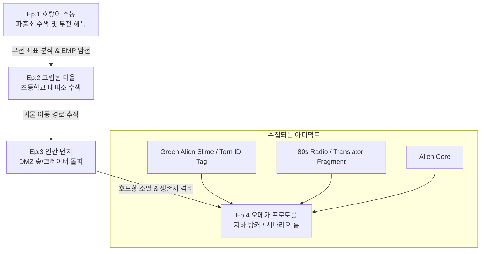

# <호포항 통제구역: 오메가 프로토콜> 게임 시나리오 및 에피소드 레벨 디자인 가이드

> [!WARNING]
> **Superseded pre-release concept.** This document preserves an early speculative design and is not current canon. Use the authoritative [`game_story_bible.md`](./game_story_bible.md) for the complete four-episode narrative; implemented Episode 1–4 behavior remains defined by [`lib/game/episode1.ts`](../lib/game/episode1.ts), [`lib/game/episode2.ts`](../lib/game/episode2.ts), [`lib/game/episode3.ts`](../lib/game/episode3.ts), [`lib/game/episode4.ts`](../lib/game/episode4.ts), and [`app/guide/page.tsx`](../app/guide/page.tsx).

이 문서는 영화 <호프(HOPE)>의 냉전 시대 분위기와 코스믹 호러 세계관을 차용하고, 고전 명작 게임 <유작(遺작)>의 하드코어 Point-and-Click 퍼즐 메커니즘을 결합한 텍스트 RPG 게임의 전체 스토리라인 및 에피소드 레벨 설계도입니다. 개발자는 각 에피소드를 구현할 때 본 문서의 시나리오 및 트리거 벨트(Trigger Belt) 로직을 참고하여 설계해야 합니다.

---

## 🌌 1. 전체 시나리오 개요 (Overall Scenario Overview)

본 게임은 1970-80년대 Cold War 시대, 비무장지대(DMZ) 인근의 외딴 어촌 마을인 **호포항(Hopo Port)**을 배경으로 합니다. 
주인공은 호포항 파출소장 **범석(황정민 역)**으로, 처음에는 단순한 "멧돼지나 호랑이 소동"으로 접수된 가축 습격 사건을 조사하기 시작합니다. 그러나 조사가 진행됨에 따라 마을 전체가 인류의 인지를 넘어서는 거대한 우주적 존재(Cosmic Horror)에 잠식당하고 있음을 깨닫게 됩니다.

게임은 에피소드별 단절된 구성이 아니라, 플레이어가 각 에피소드에서 획득한 단서와 아이템이 다음 단계의 퍼즐을 푸는 열쇠가 되고, 최종적으로 호포항 소멸 이후 지하 방커의 시나리오 제안실로 수렴하는 **유기적 루프 구조**를 가집니다.

---

## 🔗 2. 에피소드 간 스토리 연결 루프 (Narrative Connection Loop)

1. **Episode 1:** 파출소 내부에서 외계 신호를 해독하고 신호의 근원이 파출소 내부에 설치된 비콘임을 발견. 비콘이 활성화되며 외부와 무전이 끊기고, 우주 궤도에서 지구를 향해 하강하는 거대한 외계 존재를 예고하며 암전.
2. **Episode 2:** 전파 장애(EMP)로 고립된 호포항 마을. 범석은 생존 주민들이 모여있는 대피소(초등학교)로 향함. 누군가 의도적으로 외계 존재를 끌어들이고 있음을 발견하고, 외계 신호 분석용 "외국인 통역기 파편"을 획득.
3. **Episode 3:** 괴물을 직접 처단하겠다며 총기를 들고 DMZ 숲으로 들어간 청년들을 추적. 물리 법칙이 붕괴된 기괴한 포자 숲을 뚫고 들어가 추락한 외계 비행체의 "외계 코어(Alien Core)"를 확보하나, 거대 외계 생명체에 포위되어 호포항 전체가 흔적도 없이 증발.
4. **Episode 4:** 암전 후, 호포항 지하에 비밀리에 건설되어 있던 정부 통제소(지하 방커)에서 소장 범석이 눈을 뜸. 수집한 모든 단서를 종합하여 외계 침공 시나리오(HOPE Part 2)를 완성하고 사령부에 송신(UGC 거버넌스).

---

## 🎮 3. 에피소드별 상세 디자인 (Detailed Episode Level Design)

### 🐯 Episode 1: 호랑이 소동 (Tiger Commotion)
* **공간적 배경:** 호포 파출소 사무실, 앞마당(철조망), 어두운 창고(Backroom).
* **스토리라인:** 
  어부가 산에서 호랑이를 봤다는 허무맹랑한 신고가 들어온다. 소장 범석은 부하 방위병들의 태만을 꾸짖으며 순찰을 지시하지만, 앞마당 철조망 근처에서 참혹하게 찢겨진 소의 사체가 발견되고 실종된 방위병 '최 일병'의 군인 인식표가 발견된다. 창고의 단말기는 정체불명의 우주 신호를 수신하고 있다.
* **진입 장벽 (Holding Rule):** 없음 (무료 데모/티저)
* **획득 핵심 아티팩트:**
  1. `Screwdriver` (일반 도구 - 수색용)
  2. `Cabinet Key` (일반 도구 - 창고 캐비닛용)
  3. `80s Radio` (퀘스트 아이템 - 신호 청취용)
  4. `Torn ID Tag` (UGC 아이템 - 실종 방위병의 인식표, 보라색 광물 부착)
  5. `Green Alien Slime` (UGC 아티팩트 - 타자기 내부에서 긁어낸 점액질)
* **트리거 벨트 퍼즐 로직 (Trigger Belt):**
  1. 플레이어가 파출소를 벗어나 바로 사건 현장인 '농로(Hopo Field)'로 나가려고 시도하면 **[실패 엔딩: 무지성적인 비극(Ignorance-born Tragedy)]**이 발동됩니다. 숲속에서 갑자기 튀어나온 무언가에 의해 호포항 청년들이 습격당하고 범석 또한 어둠 속으로 끌려갑니다.
  2. **올바른 순서:**
     - 창고(STORAGE)의 **작업대(Workbench)**를 수색하여 `Screwdriver`와 `Cabinet Key`를 얻는다.
     - `Cabinet Key`를 장착하고 창고 안쪽의 **무기 캐비닛(Locked Cabinet)**을 열어 `80s Radio`를 획득한다.
     - 사무실(OFFICE)로 돌아와 `Screwdriver`를 장착하고 작동이 안 되는 **골드스타 타자기(Typewriter)**의 나사를 풀어 내부 기어를 분해한다. 기어 사이에 고착되어 있는 `Green Alien Slime`을 긁어낸다.
     - 앞마당(FRONT_YARD)으로 나가 철조망 구석에 걸려 빛나는 **군인 인식표(Torn ID Tag)**를 획득한다.
     - `Green Alien Slime`을 `80s Radio`에 주입/정렬하여 오염된 주파수를 정밀 조율하면, 노이즈 속에 가려져 있던 괴상한 외계 신호가 완전 해독된다.
* **다음 단계 전환:** 
  신호 해독 완료 직후, 파출소의 녹색 CRT 레이더가 폭주하며 신호의 발신 근원지가 호포항 초등학교 대피소임을 지목합니다. 그 순간 강력한 전자기 펄스(EMP)가 발생하여 모든 전등이 깨지고 암전되며 에피소드가 완료됩니다.

---

### 📴 Episode 2: 고립된 신호 (Disconnected Signals)
* **공간적 배경:** 호포 초등학교 본관 (교무실, 보건실, 당직실/행정실).
* **스토리라인:** 
  통신이 완전히 두절되고 보라색 안개가 마을을 감싼다. 범석은 주민들이 모인 대피소인 초등학교에 도착하지만, 학교 안은 기괴할 정도로 조용하다. 주민들은 알 수 없는 긴장감 속에 방안에 갇혀 있고, 복도 끝에서는 80년대 군용 무전기를 통해 영어로 대화하는 정체불명의 목소리("...they are responding to the bio-signatures...")가 울려 퍼진다. 마을 내부에 외계 존재를 유도하는 조력자(Collaborator)가 있는 것이 분명하다.
* **진입 장벽 (Holding Rule):** 지갑에 **5,000 $NAHOPE** 토큰 보유.
* **획득 핵심 아티팩트:**
  1. `Emergency Fuse` (일반 도구 - 발전기 복구용)
  2. `Foreigner's Journal` (단서 - 마이클 패스벤더의 기록물)
  3. `Translator Fragment` (UGC 아티팩트 - 외계어 번역 장치 파편)
* **트리거 벨트 퍼즐 로직 (Trigger Belt):**
  1. 학교 방송실은 두꺼운 보안 문으로 잠겨 있습니다. 발전기가 나가 전력이 차단되었기 때문입니다.
  2. 범석이 퓨즈를 끼우지 않은 채 무리하게 발전기 수동 레버를 돌리거나, 손전등 없이 어두운 보건실을 수색하려 하면 **[실패 엔딩: 어둠 속의 습격(Stalker in the Fog)]**이 발생하여 복도에서 대기하던 괴물에게 살해당합니다.
  3. **올바른 순서:**
     - 어두운 교무실 벽면에 그려진 어린이들의 기괴한 그림(눈이 여러 개 달린 하늘, 숫자가 적힌 묘비)을 분석하여 당직실의 키 박스 비밀번호(`723` - 신호가 시작된 7월 23일 상징)를 알아냅니다.
     - 비밀번호로 키 박스를 열어 `Emergency Fuse`와 보건실 열쇠를 획득합니다.
     - 보건실 안을 수색하여 침대 밑 가방에서 외계인의 언어를 분석하던 외국인 조사관의 `Foreigner's Journal`과 파손된 `Translator Fragment`를 확보합니다.
     - 지하 보일러실로 내려가 `Emergency Fuse`를 발전기 보드에 끼우고 가동하여 학교 전체 전력을 복구합니다.
     - 전력이 복구된 방송실 단말기에 `Translator Fragment`를 연결하여 학교 스피커로 재생되던 정체불명의 괴 주파수를 번역합니다.
* **다음 단계 전환:**
  번역 장치에서 흘러나오는 메시지: *"The sacrifice is prepared. Head to the boundary of the forest."* (제물이 준비되었다. 숲의 경계로 오라.) 스피커에서 흘러나오는 초고주파 소리에 미쳐 날뛰며 학교를 탈출한 마을 청년들이 총을 들고 DMZ 숲으로 달려 들어가는 발자국을 발견하고 범석은 숲으로 향합니다.

---

### 💀 Episode 3: 인간 먼지 (Human Dust)
* **공간적 배경:** DMZ 통제 구역 숲, 지뢰밭 지대, 외계 비행체 추락 분지(Crater).
* **스토리라인:** 
  숲속은 중력이 불규칙하게 작용하고, 보라색 외계 포자가 공기 중에 날아다녀 숨을 쉬기조차 어렵다. 짐승을 사냥하겠다며 떠난 마을 청년들은 이미 수분이 모두 증발해 가루가 된 '인간 먼지' 형태로 변해 숲에 흩어져 있다. 범석은 지뢰와 외계 촉수 생명체의 위협을 피해, 안개 너머 거대하게 솟아오른 15~20피트 크기의 외계 거인(Cosmic Entity)을 피해 숲의 중심부에 있는 추락지로 들어가야 한다.
* **진입 장벽 (Holding Rule):** 지갑에 **20,000 $NAHOPE** 토큰 보유.
* **획득 핵심 아티팩트:**
  1. `Chemical Filter` (일반 도구 - 포자 차단용)
  2. `Mine Detector` (일반 도구 - 지뢰밭 통과용)
  3. `Alien Core` (UGC 아티팩트 - 기하학적 형태의 동력원)
* **트리거 벨트 퍼즐 로직 (Trigger Belt):**
  1. 포자 농도가 높은 숲 깊은 곳으로 가스마스크 필터 없이 들어가면 포자 중독으로 인한 환각으로 사망합니다. 또한 지뢰 탐지 없이 지뢰밭을 밟으면 폭사합니다.
  2. **올바른 순서:**
     - 숲 입구 초소에서 방치된 군용 차량을 수색합니다. 이전 에피소드에서 획득한 `80s Radio`의 소리를 켜서 방해 전파 주파수의 진폭 변화를 감지하고, 차 안에 숨겨진 `Mine Detector`를 찾습니다.
     - `Mine Detector`의 지뢰 경보음 템포를 보며 지뢰밭 구역을 안전하게 지그재그로 수색하여, 방어병들이 버리고 간 방독면용 `Chemical Filter`를 획득합니다.
     - 가스마스크에 `Chemical Filter`를 결합하여 착용한 뒤, 보라색 포자 장벽을 통과해 추락한 외계 분지(Crater)로 도달합니다.
     - 외계 분지 중앙의 고대 묘비석 배치 퍼즐을 해독해야 합니다. 묘비 탁본에 그려진 기하학적 심볼들이 가리키는 고대 희랍어 알파벳들을 조작해 **'Ω(Omega)'** 형상으로 결합하면 잠겨있던 외계 비행체의 격벽이 열립니다.
     - 격벽 안에서 푸른 광채를 뿜는 우주 엔진인 `Alien Core`를 획득합니다.
* **다음 단계 전환:**
  범석이 `Alien Core`를 뽑아내는 순간, 숲속 어둠 속에서 20피트가 넘는 보라색 눈을 가진 외계 존재가 눈앞에 강림합니다. 순간적인 백색 섬광과 함께 호포항 일대의 대지가 붕괴하며 소멸하고, 지면이 하늘로 솟구치며 화면이 완전히 암전됩니다.

---

### 🌌 Episode 4: 오메가 프로토콜 (Omega Protocol)
* **공간적 배경:** 호포항 지하 50미터 기밀 벙커 (Project Omega Control Room).
* **스토리라인:** 
  눈을 뜨니 사방이 콘크리트 벽과 70년대 슈퍼컴퓨터로 둘러싸인 밀폐된 방이다. 호포항 지상 구역은 지도상에서 흔적도 없이 소멸했으며, 우주 궤도에는 정체불명의 비행체들이 지구로 강하하고 있다. 범석(또는 플레이어)은 정부가 비밀리에 가동한 '오메가 프로토콜'의 통제 터미널 앞에 서 있다. 지상에서 수집해 온 3가지 외계 아티팩트들을 터미널에 주입해 이 우주적 침공을 막을 인류의 마지막 대응 시나리오를 작성하고 우주로 발송해야 한다.
* **진입 장벽 (Holding Rule):** 에스크로 지갑에 **100,000 $NAHOPE** 타임락업(Time-Lock).
* **핵심 메커니즘 및 플레이어 임무:**
  1. **터미널 콘솔 접속:** 플레이어는 지갑을 연동하고 100,000 $NAHOPE를 에스크로에 예치하여 '엘리트 호포항 방위대원' 자격을 입증합니다.
  2. **아티팩트 결합 및 데이터 분석:**
     - 수집했던 아티팩트 3종(`Green Alien Slime`, `Translator Fragment`, `Alien Core`)과 실종 방위병의 `Torn ID Tag` 정보를 터미널 슬롯에 장착합니다.
     - 단말기 화면에 각 아이템의 분석 텍스트가 glitch 효과와 함께 출력됩니다.
  3. **시나리오 기획 및 제출 (CGC - Collective Narrative Creation):**
     - 플레이어는 이 아이템들의 로어(Lore)와 설정을 기반으로 **"<HOPE Part 2: Humans in Space> (우주로 진출한 인류와 외계 존재의 결전)"** 시나리오 시놉시스(영문/국문)를 작성하여 터미널에 입력합니다.
     - 작성된 시나리오는 Firebase Firestore에 저장되어 웹 메인의 [Scenario Feed]로 즉시 전송됩니다.
  4. **보상 및 소각 거버넌스:**
     - 제출된 시나리오는 전체 커뮤니티 투표(토큰 보팅)를 거칩니다.
     - 매 주/월별 최고의 시나리오로 선정된 작성자에게는 소정의 `$NAHOPE` 에어드랍 보상이 지급됩니다.
     - 최종적으로 가장 많은 표를 얻은 시나리오는 기밀 정부 문서 컨셉의 실물 책자로 제작되어 배급사(Forged Films) 및 나홍진 감독에게 직접 전달됩니다.

---

## 🛠️ 4. 개발자를 위한 연동 가이드 (Developer Reference)

1. **상태 관리 (`app/game/page.tsx`):**
   - 각 에피소드는 플레이어의 Firestore 데이터베이스 내 `currentEpisode` 필드 값에 따라 렌더링을 제어해야 합니다.
   - 아이템 장착 여부는 기존 `activeItem` 상태를 유지하되, 각 에피소드 퍼즐 클리어 상태(`unlockedHotspots`)와 연계해야 합니다.

2. **토큰 게이트 미들웨어:**
   - 에피소드 2, 3, 4로 진입 시, 서버 사이드 또는 클라이언트 사이드에서 Solana RPC API를 호출하여 지갑의 `$NAHOPE` 잔고를 실시간 검증합니다.
   - 기준에 미달하는 유저의 경우 접근 제한 경고 모달을 띄우며 플레이를 잠금 처리합니다.

3. **UGC 공유 및 보상:**
   - 각 아티팩트를 획득할 때마다 우측 패널의 [SHARE MEME ON X] 버튼이 활성화됩니다.
   - 트위터 API 연동 혹은 단순 Web Intent URL 생성을 통해 유저들이 자신만의 2차 창작 밈을 포스팅하도록 유도하며, 이는 커뮤니티 온체인 방어를 위한 마케팅 기제로 작동합니다.
